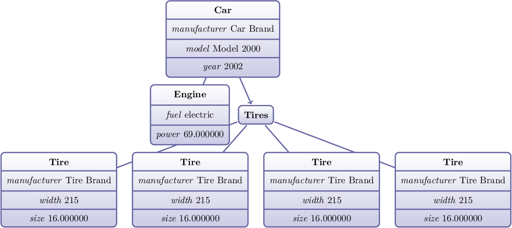

Data structure dumping library
==============================

This is a Clang ASTDumper-inspired data structure dumping library based on the
Curiously Recurring Template Pattern. It supports multiple views on the same
types by tag dispatching and requires only a thin visitor wrapper to direct the
dumper in custom data structures.

The Clang implementation can be found here: `ASTDumper.cpp
<https://clang.llvm.org/doxygen/ASTDumper_8cpp_source.html>`_.

Supported output formats
------------------------

- ANSI color coded text (highlighted in shells)
- Plain text
- LaTeX PGF/TikZ graphdrawing figures
- LaTeX forest figures

Some examples
-------------

In `test/include/dump/demo/ <test/include/dump/demo/>`_ you can find an example
that resembles a composite struct of two types and an enum. It's a boring but
typical car example and should do the trick though. Two different dumpers are
defined, a full and a reduced one. Test cases in `test/src/dump/
<test/src/dump/>`_ will generate the outputs for each of the four output
formats. The results are kept in `res/ <res/>`_.

Plaintext with ANSI color codes:

LaTeX using ``forest`` package:

LaTeX using PGF/TikZ package's ``graphdrawing`` library:

Last but not least the simple plain text output:::

   Car manufacturer 'Car Brand' model 'Model 2000' year '2002'
   |- main engine Engine fuel electric power '69.000000'
   `- tires Tires size '4'
     |- item Tire manufacturer 'Tire Brand' width '215' size '16.000000'
     |- item Tire manufacturer 'Tire Brand' width '215' size '16.000000'
     |- item Tire manufacturer 'Tire Brand' width '215' size '16.000000'
     `- item Tire manufacturer 'Tire Brand' width '215' size '16.000000'

Supported high level containers
-------------------------------

- ``std::array``
- ``std::map``
- ``std::vector``
- ``std::set``
- ``std::shared_ptr``
- ``boost::multi_index_container``
- ``boost::optional``
- ``boost::spirit::x3::variant``
- ``boost::variant``

Implementing support for other containers is trivial as it only requires to add
a call operator overload for the container and it's value type (if necessary,
see ``std::map``).

Native support for any kind of graphs based on pointers or references is only
implemented in the ``tikz_dumper`` which remembers the objects it has already
seen. For all the other dumpers it is suggested to retrieve the distinct set of
nodes from the graph and use this as an input to the dumper.

License
-------

This work is licensed under the MIT license.

Disclaimer
----------

As this is a personal project I did only develop it as far as needed to fulfil
my own needs. I welcome suggestions and improvements and would be glad if it is
useful for anyone. Still I provide it without warranty or in-depth
documentation. If you have questions please do not hesitate to ask.
